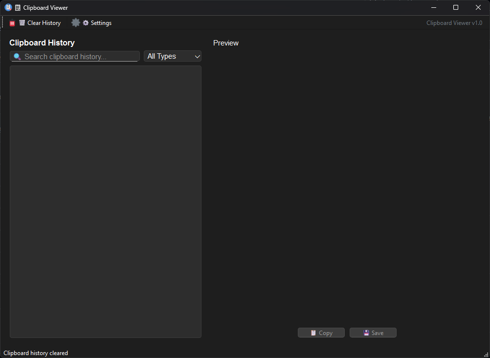
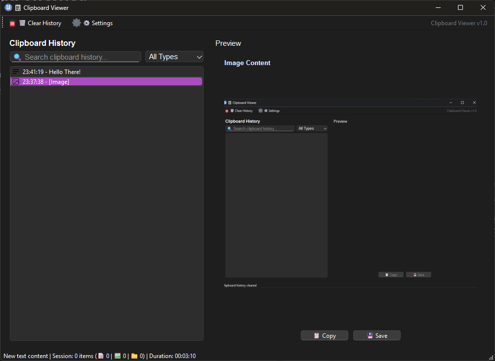

# Clipboard Viewer

A powerful Python application that monitors and maintains a comprehensive history of all clipboard content, allowing you to view, search, and restore any previously copied item with ease.

## Screenshots




## ✨ Features

### 🔄 Real-time Clipboard Monitoring
- **Automatic Capture**: Monitors clipboard changes in real-time
- **Multi-format Support**: Handles text, images, files, and custom formats
- **Smart Detection**: Identifies content types automatically
- **Background Operation**: Runs silently in system tray

### 📚 History Management
- **Persistent Storage**: SQLite database for reliable history storage
- **Configurable Limits**: Set maximum history size and retention periods
- **Automatic Cleanup**: Removes old entries based on age or count
- **Database Optimization**: Indexed queries and automatic compaction

### 🔍 Search & Organization
- **Advanced Search**: Find content by type and keywords
- **Type Filtering**: Filter by text, images, or files
- **Favorites System**: Database support for pinning items (UI coming soon)
- **Session Statistics**: Track clipboard usage with detailed metrics

### 🎨 User Interface
- **Modern Design**: Clean PyQt6 interface with dark/light themes
- **Responsive Layout**: Adapts to different screen sizes
- **Preview Pane**: View images and formatted text directly
- **System Tray Integration**: Minimal footprint with full functionality
- **Toast Notifications**: Real-time feedback with statistics

### ⚙️ Customization
- **Hotkey Support**: Customizable keyboard shortcuts
- **Theme Selection**: System, light, or dark themes
- **Notification Settings**: Configure duration and display options
- **Startup Options**: Launch with Windows startup

### 📊 Advanced Features
- **Export Functionality**: Save clipboard history to JSON format (API available)
- **Session Tracking**: Monitor clipboard usage patterns
- **Responsive Design**: Adapts to different screen sizes and orientations

## 🚀 Quick Start

### Prerequisites
- **Python 3.8+**
- **Windows 10+** (primary target)
- **50MB free disk space**

### Installation

1. **Clone the repository**:
   ```bash
   git clone <repository-url>
   cd Clipboard-Viewer
   ```

2. **Install dependencies**:
   ```bash
   pip install -r requirements.txt
   ```

3. **Run the application**:
   ```bash
   python src/main.py
   ```

## 📖 Usage Guide

### Getting Started
1. **Launch**: Run the application - it starts monitoring automatically
2. **Access History**: Use system tray icon or hotkey (default: `Ctrl+Shift+V`)
3. **Copy Items**: Double-click any history item to restore it to clipboard
4. **Search**: Use the search bar to find specific content quickly
5. **Preview**: Select items to view detailed preview in the right panel

### Advanced Features
- **Type Filtering**: Use the dropdown to filter by text, images, or files
- **Clear History**: Remove all items or keep only favorites
- **Settings**: Configure themes and startup options
- **Statistics**: View session statistics in notifications and status bar
- **Responsive Layout**: Resize window to see adaptive interface changes

## 🏗️ Project Structure

```
Clipboard-Viewer/
├── src/
│   ├── main.py                 # Application entry point
│   ├── clipboard_monitor.py    # Real-time clipboard monitoring
│   ├── history_manager.py      # History storage and management
│   ├── gui/
│   │   ├── main_window.py      # Main application window
│   │   ├── history_view.py     # Clipboard history display
│   │   ├── preview_widget.py   # Content preview component
│   │   └── settings_dialog.py  # Settings configuration
│   └── utils/
│       ├── database.py         # SQLite database operations
│       ├── clipboard_utils.py  # Clipboard data handling
│       ├── hotkeys.py          # Global hotkey management
│       ├── system_tray.py      # System tray integration
│       └── notification_manager.py # Toast notifications
├── assets/
│   └── icons/                  # Application icons
├── data/                       # User data and database
├── requirements.txt            # Python dependencies
└── README.md
```

## ⚙️ Configuration

### Settings File
Settings are stored in `data/config.json` and Windows Registry:

```json
{
  "appearance": {
    "theme": "System"
  },
  "general": {
    "start_minimized": false,
    "max_history_items": 1000,
    "auto_cleanup_days": 30
  }
}
```

### Available Settings
- **Theme**: System, Light, or Dark theme
- **Start with Windows**: Automatically launch on system startup
- **History Limits**: Maximum items and retention period (configured in code)
- **Hotkeys**: Toggle window visibility (default: `Ctrl+Shift+V`)

### Database
- **Location**: `data/clipboard_history.db`
- **Optimization**: Automatic indexing and compaction
- **Backup**: Manual export available through API