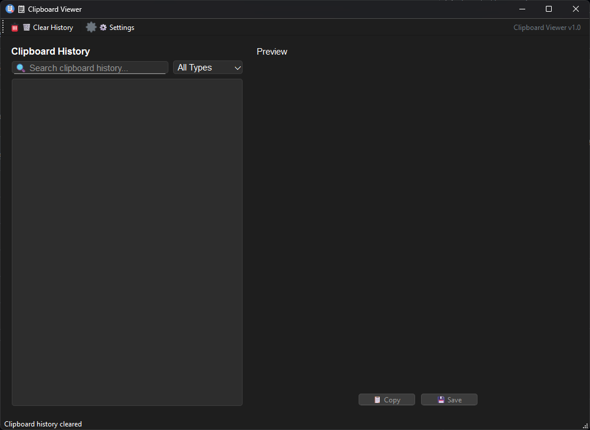

# Clipboard Viewer

> A lightweight Windows clipboard history manager with real-time monitoring, SQLite persistence, search, and system tray integration.

[](https://github.com/OneAutumnLeaf4700/Clipboard-Viewer/actions/workflows/tests.yml)
[](https://github.com/OneAutumnLeaf4700/Clipboard-Viewer/actions/workflows/build.yml)
[](https://github.com/OneAutumnLeaf4700/Clipboard-Viewer/releases)
[](LICENSE)

<!-- TODO: replace with 15-second GIF demo (record with ScreenToGif, save to docs/demo.gif) -->


## Features

- **Real-time monitoring** — captures text, images, and files from the clipboard automatically
- **Persistent history** — SQLite-backed storage with configurable size and retention limits
- **Search & filter** — full-text search and content-type filtering (text / image / file)
- **System tray integration** — runs quietly in the background; toggle via hotkey
- **Themes & UI** — PyQt6 interface with dark / light / system themes and responsive layout
- **Customizable hotkeys** — default `Ctrl+Shift+V` to toggle the viewer
- **Toast notifications** — real-time feedback with session statistics
- **Export** — save history to JSON for backup or external use
- **Windows startup** — optional auto-launch on system boot

## Tested Platforms

- Windows 10 / 11 (primary target)
- macOS / Linux are **not currently supported** — the app depends on `pywin32` and Windows-specific clipboard APIs

## Installation

### Option 1 — Prebuilt Windows executable (recommended)
1. Go to the [Releases](https://github.com/OneAutumnLeaf4700/Clipboard-Viewer/releases) page
2. Download the latest `ClipboardViewer.exe` (and `install.bat` if you want a Start Menu shortcut)
3. Run `install.bat` as Administrator, or just double-click the `.exe`

### Option 2 — Run from source
Prerequisites: **Python 3.8+** on Windows.

```bash
git clone https://github.com/OneAutumnLeaf4700/Clipboard-Viewer.git
cd Clipboard-Viewer
pip install -r requirements.txt
python src/main.py
```

## Usage

1. **Launch** — the app starts in the system tray and begins monitoring immediately
2. **Open the viewer** — click the tray icon or press `Ctrl+Shift+V`
3. **Restore an item** — double-click any history entry to copy it back to the clipboard
4. **Search** — type in the search bar to filter entries by content
5. **Filter by type** — use the dropdown to show only text, images, or files
6. **Settings** — right-click the tray icon for theme, startup, and hotkey options

## Privacy & Security

> **Important — please read before installing.**

Clipboard Viewer captures **everything** you copy: text, images, and file paths. This includes:

- Passwords from a password manager
- Authentication tokens, API keys, and secrets
- Private messages, emails, and documents
- Card numbers, addresses, and other sensitive personal data

**All captured data is stored unencrypted** in a local SQLite database at `data/clipboard_history.db`. There is no cloud sync, telemetry, or external transmission — but anyone with access to your user account on this machine can read the database directly.

**Recommendations:**

- **Pause the app when using a password manager.** Most (Bitwarden, 1Password, KeePassXC) auto-clear the clipboard after ~30 seconds, but this tool will still capture the secret during that window
- Clear history regularly via the UI (*Clear History*)
- Do not run on a shared or multi-user machine
- Review what's in the database before sharing screenshots, screen recordings, or backups

This tool is intended for personal productivity use on a single-user machine. It is **not** appropriate for environments handling regulated data (PII, PHI, PCI, classified material, etc.).

## Development

### Setup
```bash
git clone https://github.com/OneAutumnLeaf4700/Clipboard-Viewer.git
cd Clipboard-Viewer
python -m venv venv
venv\Scripts\activate
pip install -r requirements.txt
pip install -r requirements-build.txt
```

### Run tests
```bash
pytest --cov=src --cov-report=term-missing
```

### Build a Windows executable locally
```bash
python build.py
```

### Project layout
```
Clipboard-Viewer/
├── src/
│   ├── main.py                      # Application entry point
│   ├── clipboard_monitor.py         # Real-time clipboard polling
│   ├── history_manager.py           # History storage and retention
│   ├── gui/
│   │   ├── main_window.py           # Main application window
│   │   ├── preview_widget.py        # Content preview pane
│   │   ├── settings_dialog.py       # Settings UI
│   │   ├── components/              # Reusable view components
│   │   └── themes/                  # Theme assets
│   └── utils/
│       ├── database.py              # SQLite operations
│       ├── clipboard_utils.py       # Clipboard data adapters
│       ├── hotkeys.py               # Global hotkey registration
│       ├── system_tray.py           # System tray integration
│       └── notification_manager.py  # Toast notifications
├── tests/                           # pytest suite
├── docs/                            # Screenshots, design notes
├── .github/workflows/               # CI: build, test, release
└── build.py                         # PyInstaller build script
```

## Troubleshooting

**App won't start / system tray icon missing.** Confirm you're on Windows 10 or later. Check `data/clipboard_viewer.log` for errors.

**Hotkey doesn't work.** Another app may have grabbed `Ctrl+Shift+V` — change the hotkey in Settings or close the conflicting app. The `keyboard` library may also require elevated privileges; try running as Administrator.

**Clipboard captures aren't appearing.** Some apps (Office, browsers in incognito mode, password managers) write to the clipboard with formats that may not be readable. Check the log for unhandled-format warnings.

**Database errors on startup / corrupted DB.** Close the app, delete `data/clipboard_history.db`, restart. (You'll lose history.)

**Want to start fresh?** Delete the `data/` folder. The app will recreate it on next launch.

## Contributing

Issues and pull requests are welcome. Please:

- Open an issue first to discuss any non-trivial change
- Run `pytest` and ensure tests pass before submitting
- Follow PEP 8

## License

[MIT](LICENSE) © 2026 Rayyan
